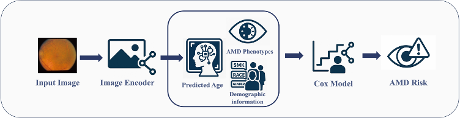

### Installation
Set up the environment with **Python 3.12**:
```bash
conda create -n xxx python=3.12
```
Install additional dependencies:
```bash
pip install -r rq.txt
```
###  Verify the intalled environment
Here is the 5-fold cross validation results on AREDS Dataset with reading-center-defined phenotypes

| Backbone | Fold   | Phenotypes | Demographic | Age (Loss)        | C‑Index |
|----------|--------|------------|-------------|-------------------|---------|
| VMamba   | fold‑1 | Yes        | smk         | Pred (MAE + CoxPH) | 0.878   |
| VMamba   | fold‑2 | Yes        | smk         | Pred (MAE + CoxPH) | 0.869   |
| VMamba   | fold‑3 | Yes        | smk         | Pred (MAE + CoxPH) | 0.883  |
| VMamba   | fold‑4 | Yes        | smk         | Pred (MAE + CoxPH) | 0.886   |
| VMamba   | fold‑5 | Yes        | smk         | Pred (MAE + CoxPH) | 0.882   |
| VMamba   | all    | Yes        | smk         | Pred (MAE + CoxPH) | 0.888   |
###  Start 

### Data Preparation

To train and evaluate the **AREDS test set** with the Cox model  
(`d_age_cox.py`, `cox` function — see *line 423*), the input
table **must** contain the following columns:

| Category       | Field(s)                               | Notes / Expected format                    |
|----------------|----------------------------------------|-------------------------------------------|
| **Demographics** | `age`, `smk` | - `age`: numerical (chronological age)  <br>- `smk`: smoking status  <br>
| **Reading-center-defined phenotypes** | `GEOAWI`, `DRARWI`, `RPEDWI`, `INCPWI`| Four Reading-center-defined phenotypes required by the model |
| **Specialist-defined phenotypes** | `DRUSENQ`, `PIGDRUQ` | Two Specialist-defined phenotypes required by the model |
> Ensure all required fields are present and free of missing values; otherwise  
> the Cox routine will raise a validation error.

### FundusAge Model 

To generate biological age values:

1. **Prepare Checkpoints**  
   Place all model checkpoints in the `./result_p` directory.

2. **Run Prediction**  
   Execute the following command to get predictions for each fold (X = 1–5):

   ```bash
   python d_age_cox.py --train_fold X
   ```
   After successful execution, a file named `fold_X_test.csv` will be generated in the root directory.
3. **AREDS Data Matching by ID**
    The image loading is based on patient/image IDs. Please ensure you prepare the correct CSV file with IDs matching the image filenames(see `AMD_gen_52new.csv` & `patient_gen_52.csv`), I get the info using **get_id()** function in `data_id_age_cox.py`

    Modify the Following Lines If Needed. To ensure correct image loading paths, you may need to adjust:

    - `d_age_cox.py`: lines 562, 566

    - `dataset_age_cox.py`: line 33

    For example, image loading is defined as:
    ```python
    X = Image.open('/prj0129/mil4012/AREDS/AMD_224/' + ID[:-4] + '.jpg')
    ```
    Make sure this path and file format match your local data setup.

4. **Run Cox Evaluation on Predicted Results**

After generating all 5 folds of test results, run `cox_test.py` to evaluate each fold's Cox performance.

- Use the `test_fold` variable at **line 280** of `cox_test.py` to specify which fold to evaluate:
  - `test_fold = 1` to `5`: evaluate individual folds
  - `test_fold = 0`: evaluate the **ensemble result** by combining predictions from all five folds
  - see our **biological age results** and **data spilt** for **AREDS** in `./result_v3`

```python
# Example (cox_test.py, line 280)
test_fold = 0  # use 0 for ensemble prediction
```
- Building and test with Reading-center based Cox model:
   ```python
   python cox_test.py
   ```
- Building and test with Specialist based Cox model:
   ```python
   python cox_doc.py
   ```
- Replace **biological age** with **chronological age**:
   - set `bio = False` in `cox_test.py` line 305

